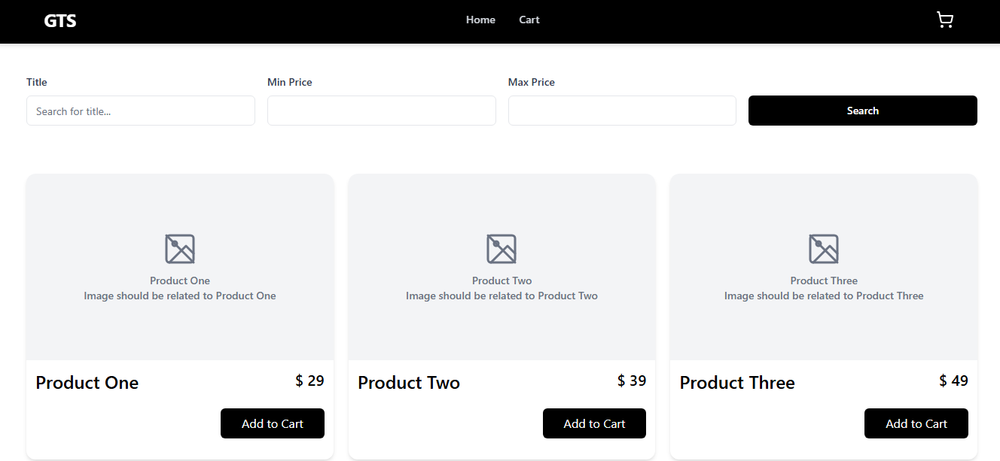
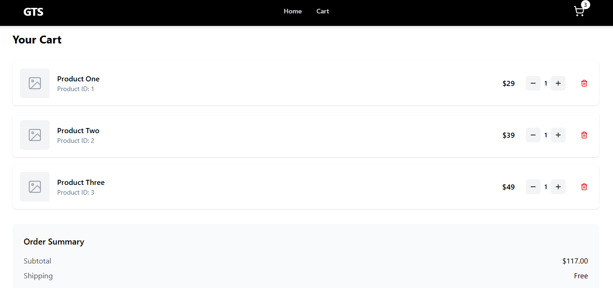

# Shopping Cart App 🛒

This is a simple **Shopping Cart Application** built using **React (TypeScript)** and **React Router**.  
It allows users to browse products, add them to the cart, increase/decrease quantities, and view a summary of their order.

## 🚀 Features

✅ View a list of available products  
✅ Add products to the cart  
✅ Increase or decrease item quantity in the cart  
✅ Remove items when quantity reaches zero  
✅ View total price in the cart

## 🛠️ Tech Stack

- **React** (with TypeScript) ⚛️
- **React Router** (for navigation) 🛣️
- **TailwindCSS** (for styling) 🎨

---

## 📂 Project Structure

src/
├── App.tsx # Main component with routing and state management
├── components/
│ └── Navbar.tsx # Navigation bar component
│ └── ProductDisplay.tsx # Navigation bar component
├── pages/
│ ├── Home.tsx # Home page with product listing
│ └── Cart.tsx # Cart page with cart management
├── types/
│ └── types.ts # Type definitions for products and cart items
└── App.css # Styles for the application

## 📜 Code Overview

### **`App.tsx`** - Main Entry Point

- Manages the **state** of products using `useState`
- Defines functions for **adding to cart, increasing, and decreasing quantity**
- Passes relevant props to `Home.tsx` and `Cart.tsx`

### **`Home.tsx`** - Product Listing

- Displays a list of available products
- Allows users to add products to the cart

### **`Cart.tsx`** - Shopping Cart Page

- Displays items added to the cart
- Allows users to **increase/decrease quantity**
- Displays the **total price**

### **`Navbar.tsx`** - Navigation Bar

- Shows a cart icon with the number of items added

### **`types.ts`** - Type Definitions

- Defines the **Product** type with `id`, `name`, `price`, `addedToCart`, and `quantity`

---

## 📦 Installation & Usage

### **1️⃣ Clone the repository**

```sh
git clone https://github.com/BibekKoirala07/gts_client.git
cd gts_client
```

### It looks like this

#### Home Page



#### Cart Page


